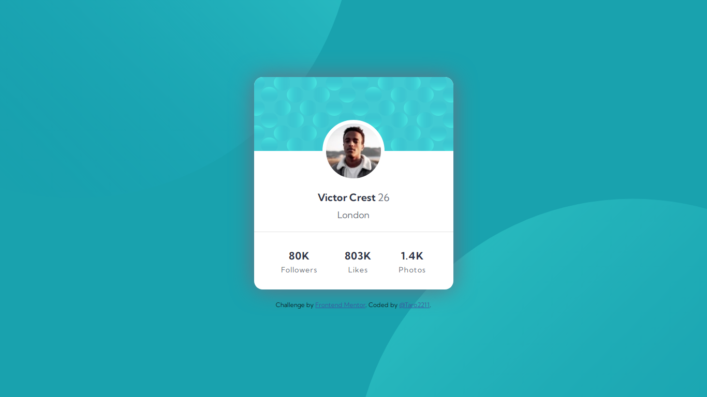

# Frontend Mentor - Profile card component solution

This is a solution to the [Profile card component challenge on Frontend Mentor](https://www.frontendmentor.io/challenges/profile-card-component-cfArpWshJ). Frontend Mentor challenges help you improve your coding skills by building realistic projects. 

## Table of contents

- [Overview](#overview)
  - [The challenge](#the-challenge)
  - [Screenshot](#screenshot)
  - [Links](#links)
- [My process](#my-process)
  - [Built with](#built-with)
  - [Useful resources](#useful-resources)
- [Author](#author)

## Overview

### The challenge

- Build out the project to the designs provided

### Screenshot

### Links

- Solution URL: [https://www.frontendmentor.io/solutions/profile-card-component-main-challenge-using-html-css-lnC1xHpHo](https://www.frontendmentor.io/solutions/profile-card-component-main-challenge-using-html-css-lnC1xHpHo)
- Live Site URL: [https://taro2211.github.io/frontendmentor/profile-card-component-main/index.html](https://taro2211.github.io/frontendmentor/profile-card-component-main/index.html)

## My process

### Built with

- Semantic HTML5 markup
- CSS custom properties
- Flexbox

### Useful resources

- [stackoverflow.com](https://stackoverflow.com/questions/) 
- [w3schools.com](https://www.w3schools.com/)

## Author

- Frontend Mentor - [@Taro2211](https://www.frontendmentor.io/profile/Taro2211)
