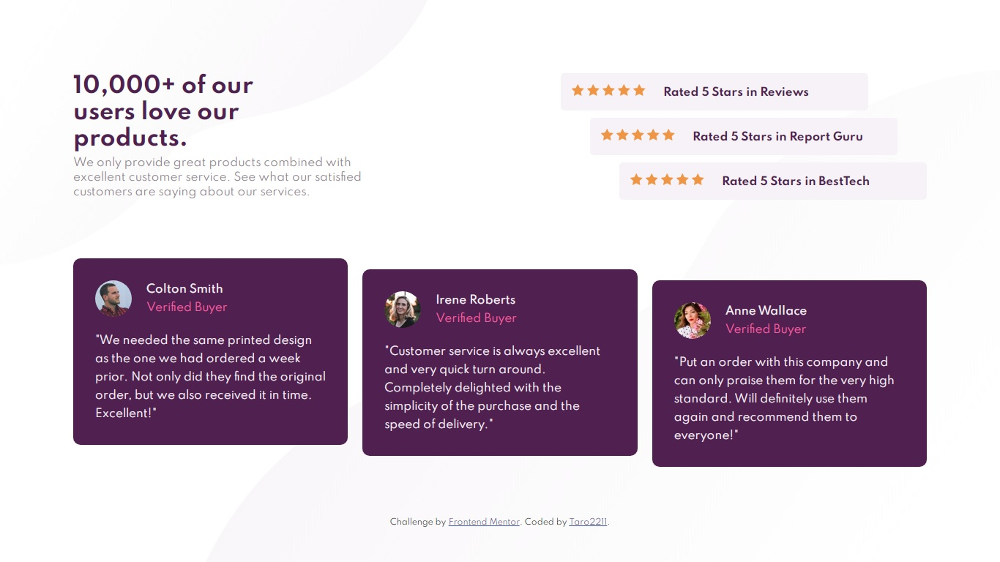

# Frontend Mentor - Social proof section solution

This is a solution to the [Social proof section challenge on Frontend Mentor](https://www.frontendmentor.io/challenges/social-proof-section-6e0qTv_bA). Frontend Mentor challenges help you improve your coding skills by building realistic projects. 

## Table of contents

- [Overview](#overview)
  - [The challenge](#the-challenge)
  - [Screenshot](#screenshot)
  - [Links](#links)
- [My process](#my-process)
  - [Built with](#built-with)
  - [Useful resources](#useful-resources)
- [Author](#author)
## Overview

### The challenge

Users should be able to:

- View the optimal layout for the section depending on their device's screen size

### Screenshot

### Links

- Solution URL: [https://www.frontendmentor.io/solutions/social-proof-section-challenge-using-html-css-css-flexbox-ilfxB93EA](https://www.frontendmentor.io/solutions/social-proof-section-challenge-using-html-css-css-flexbox-ilfxB93EA)
- Live Site URL: [https://taro2211.github.io/frontendmentor/social-proof-section-master/index.html](https://taro2211.github.io/frontendmentor/social-proof-section-master/index.html)

## My process

### Built with

- Semantic HTML5 markup
- CSS custom properties
- Flexbox
- Desktop-first workflow

### Useful resources

- [https://www.w3schools.com/](https://www.w3schools.com/)
- [https://stackoverflow.com/](https://stackoverflow.com/questions) 
- 
## Author

- Frontend Mentor - [@Taro2211](https://www.frontendmentor.io/profile/Taro2211)
